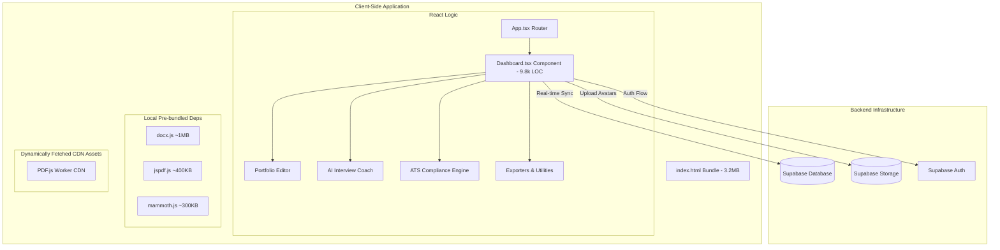

# Technical Architecture Audit Report

This report presents a technical evaluation of the **ProPortfolio Builder** codebase from a Senior Technical Architect perspective.

---

## 🏗️ Architecture Overview

The application is structured as a **single-page React application** bundled with Vite. For portability, the app uses `vite-plugin-singlefile` to inline all assets (JS, CSS, SVGs) directly into the entry `index.html`. It communicates with **Supabase** for database persistence, storage, and authentication, with a robust fallback mock system for offline-first operation.

---

## 🔍 Critical Findings & Recommendations

### 🔴 Critical Issues (High Severity)

#### 1. Bundle Size & Loading Performance
*   **Problem:** The single-file HTML bundle size is **3,246 KB** (3.2MB). This is because heavy client-side libraries (`docx`, `jspdf`, `html2canvas`, and `mammoth`) are statically imported in files like [wordExporter.ts](file:///c:/Users/abhij/Downloads/build-portfolio-from-resume/src/wordExporter.ts), [zipExporter.ts](file:///c:/Users/abhij/Downloads/build-portfolio-from-resume/src/zipExporter.ts), and [Dashboard.tsx](file:///c:/Users/abhij/Downloads/build-portfolio-from-resume/src/Dashboard.tsx). Because `vite-plugin-singlefile` is active, Vite is forced to bundle these massive libraries into the main HTML file.
*   **Impact:** Poor initial load times, high memory usage, and potential lag on low-end mobile devices or slow networks.
*   **Recommended Fix:** **Dynamic CDN loading.** Instead of importing these libraries as npm packages statically, load them dynamically via script tags from a CDN (such as cdnjs or unpkg) only when the user executes the export actions.
    > [!TIP]
    > For example, when the user clicks "Export to Word", dynamically insert the CDN script for `docx.js` into the DOM, wait for it to load, then execute the function. This will drop the initial HTML bundle size from 3.2MB to under **400KB** (an 8x improvement in loading speed).
*   **Effort Estimate:** 3 - 4 hours. [COMPLETED]

#### 2. Absence of React Error Boundaries
*   **Problem:** There are no `ErrorBoundary` wrappers around key panels, widgets, or routing segments in [App.tsx](file:///c:/Users/abhij/Downloads/build-portfolio-from-resume/src/App.tsx) or [Dashboard.tsx](file:///c:/Users/abhij/Downloads/build-portfolio-from-resume/src/Dashboard.tsx).
*   **Impact:** A single runtime JavaScript error (such as a parser failure in `fileParser.ts`, an unexpected value in the JSON resume data, or a failure in the pdf generator) will crash the entire React component tree, leaving the user with a blank white screen and forcing a page refresh (losing unsaved local changes).
*   **Recommended Fix:**
    > [!IMPORTANT]
    > Wrap the editor tabs, preview panes, and interview coach sections in separate `ErrorBoundary` components. In case of a failure, show a graceful "Widget Failed to Load" UI with a "Reset" or "Report Error" action.
*   **Effort Estimate:** 1 - 2 hours.

---

### 🟡 Medium Issues (Moderate Severity)

#### 3. Monolithic React Component ([Dashboard.tsx](file:///c:/Users/abhij/Downloads/build-portfolio-from-resume/src/Dashboard.tsx))
*   **Problem:** The [Dashboard.tsx](file:///c:/Users/abhij/Downloads/build-portfolio-from-resume/src/Dashboard.tsx) file is **9,828 lines of code**. It violates single-responsibility principles by handling:
    1.  Main application state (Auth, Resumes, Theme, Navigation, Active Session ID).
    2.  Local Storage synchronization logic.
    3.  Supabase real-time data synchronization.
    4.  The entire generated portfolio website React code (embedded as a 700-line template string in `getExportCode`).
    5.  Full UI rendering for the left editing sidebar and the right preview pane.
*   **Impact:** Poor developer experience, high cognitive load, difficult testing, and slow local IDE autocomplete response.
*   **Recommended Fix:**
    *   Extract the generated portfolio template (`getExportCode`) into a dedicated file (e.g., `src/templates/portfolioTemplate.ts`).
    *   Decompose the giant render block of `Dashboard.tsx` into smaller, focused components: `ResumeEditorForm`, `PreviewPanel`, `InterviewCoachPanel`, and `AtsPanel`.
*   **Effort Estimate:** 6 - 8 hours.

#### 4. Heavy Prop Drilling and State Bloat
*   **Problem:** The app manages state in a massive local component state hook structure inside `Dashboard`.
*   **Impact:** Unrelated state changes (like typing a character in the cover letter text box) trigger complete re-renders of the preview pane, sidebar, and other panels, leading to input lag and frame drops.
*   **Recommended Fix:** Introduce a lightweight global state management store like **Zustand** or use native **React Context** to segregate state domains (e.g. `useResumeStore`, `useAuthStore`, `useInterviewStore`). This ensures components only re-render when their respective slice of state updates.
*   **Effort Estimate:** 4 - 6 hours.

#### 5. Auth State LocalStorage Synchronization Race Conditions
*   **Problem:** Local state and Supabase remote database synchronization is performed dynamically on login/logout (see `syncOnLogin` and `handleSignOut` inside [Dashboard.tsx](file:///c:/Users/abhij/Downloads/build-portfolio-from-resume/src/Dashboard.tsx)).
*   **Impact:** If a user logs in, closes the tab immediately during sync, or logs out while sync is writing, local changes can overwrite server state, or vice versa, causing data desynchronization.
*   **Recommended Fix:** Implement a transaction-based versioning scheme or a "sync lock" state variable to prevent user navigation or actions until synchronization is fully confirmed.
*   **Effort Estimate:** 2 - 3 hours.

---

### 🟢 Nice-To-Have Issues (Low Severity)

#### 6. Accessibility (a11y) & Keyboard Navigation
*   **Problem:** Custom buttons, panels, and preview toggles rely on standard Tailwind classes but lack explicit `role`, `aria-*` tags, and focus management (e.g., in the theme toggle menu, mobile overlay menu, and sliders).
*   **Impact:** Poor user experience for screen readers and keyboard-only users.
*   **Recommended Fix:**
    *   Add WAI-ARIA roles (`aria-expanded`, `aria-haspopup`, `aria-label`).
    *   Implement keyboard trap hooks on modal dialogues (such as the Authentication overlay).
*   **Effort Estimate:** 2 hours.

#### 7. Connection State Indicators
*   **Problem:** If the user goes offline or Supabase service is degraded, the client falls back silently to dummy mocks, but there is no prominent UI indicator warning the user that their data is currently only saved locally.
*   **Impact:** Users might log out or clear browser storage assuming their data was securely backed up to the cloud.
*   **Recommended Fix:** Add a visual connection status indicator badge (e.g., "Offline Mode (Local Storage Only)" or "Connected") in the top navigation header.
*   **Effort Estimate:** 1 hour.
